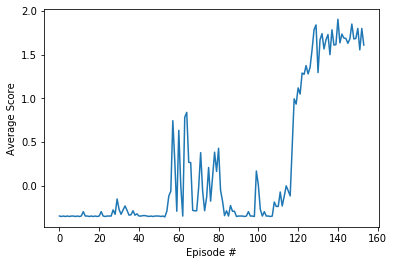

# Project 3 - Multi-agent Reinforcement Learning - Tennis
## Payam Mousavi

## Learning Algorithm

Following the suggested algorithms I selected DDPG (with a shared replay buffer). I experimented a little with different
hyperparameter values in the configuration file. The results appear to be highly sensitive to the choice of the random
number seed! In practice, to gauge the performance reliably, a more thorough hyperparameter search is needed. In addition
to the sensitivity to the random number generator seed, the results are hyper-sensitive to the environment starting point
as well. Even with the same seed, the results can't be fully reproduced. 
For the purposes of this project, I just picked a combination that met the minimum requirements. Interestingly I noticed
that decreasing the number of neurons in each hidden layer improved the performance (i.e., slower convergence)

### Hyperparameters:

- For both actor and critic networks: 2 hidden layers: (256, 128)
- Shared replay buffer
- Memory batch-size: 256
- Buffer-size: 1E6
- Update frequency: 5
- Replay without prioritization
- Learning rates:
    - Actor: 1e-4 
    - Critic: 3e-4 for critic
- discount rate: 0.98
- No weight decay
- Ornstein-Uhlenbeck noise - Used as done in the Udacity Github repo.

Full list of hyperparameters could be found in the file `config.py`

### Performance
A plot of average scores vs. episode numbers is shown below:

The environment was solved in 54 episodes. A single NVIDIA GTX1080 GPU was used for training. The training took 
approximately an hour. 

### Future Work

- A more thorough hyperparameter search
- Prioritization for replay buffer
- Not sharing the replay buffer...out of curiosity
- The training should be done for multiple random number generator seeds. I found extreme sensitivity to this.

